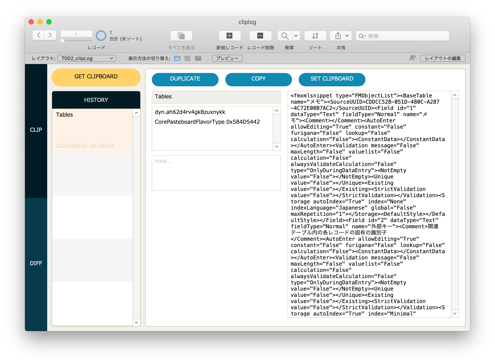
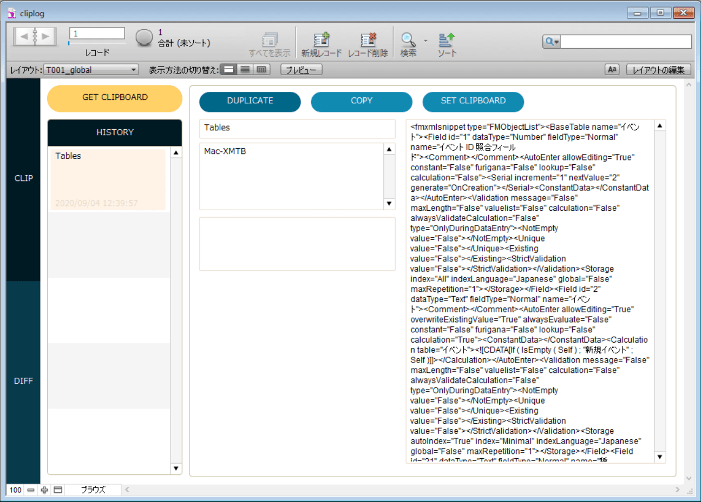

# cliplog

## 動作確認済みの環境

### ver 19

- OS: macOS 10.15.6
- FileMaker: FileMaker Pro 19

### ver 12

- OS: Windows 10 Pro
- FileMaker: FileMaker Pro 12 Advanced

## BaseElements

- cliplog.fm12 uses the BaseElements plugin, so you will need to install BaseElements.
- cliplog.fm12は、BaseElementsプラグインを使っているため、BaseElementsのインストールが必要です。

